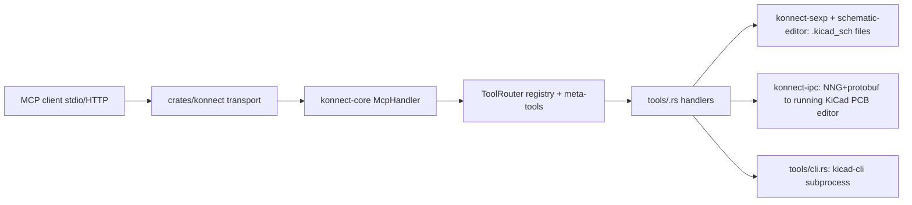

# Repository Guidelines

## Project Overview

Konnect is a native KiCad 10 plugin shipped as a single Rust binary that exposes an MCP (Model Context Protocol) server so Claude and other AI assistants can design schematics and PCBs. 238 tools in 23 lazily-loaded toolsets: schematic capture (offline `.kicad_sch` editing), PCB layout/routing (live KiCad IPC), ERC/DRC, design review, JLCPCB parts, manufacturing exports. KiCad 10 only; Windows is the most-tested platform. Licensed AGPL-3.0 + commercial (CLA, not DCO). Status: beta (`README.md`).

## Architecture & Data Flow



- **Entry**: `crates/konnect/src/main.rs` — no clap; `classify()` dispatches subcommands (`init|uninstall|status|skill|hook|transaction`), else starts the server. Piped stdin = MCP server; TTY stdin = interactive installer. `tracing` logs go to **stderr only** — stdout is protocol.
- **Config**: `crates/konnect/src/config.rs`. First existing file wins, no merge: `./konnect.toml` → `./settings.json` → `<exe>/settings.json` → `<exe>/../settings.json` → platform config dir. `--config <path>` bypasses. Transport (`stdio|http|both`) comes from config, not a CLI flag. IPC address: config `ipc_address` → `KICAD_API_SOCKET` env → auto-detect.
- **Dispatch**: `crates/konnect-core/src/mcp/handler.rs` `McpHandler::handle_message` → `dispatch` (`initialize`, `tools/list`, `tools/call`) → `execute_tool` (records `CallRecord` to `CallObserver`) → `dispatch_tool`: meta-tool → loaded tool → optional auto-load → `toolset_not_loaded`/`unknown_tool` error.
- **Router**: `crates/konnect-core/src/router/registry.rs` — `STARTER_KIT = ["project","config"]`, `ALL_TOOLSETS` (23 `ToolsetMeta` with `tool_count`), `tools_for()` cached in `OnceLock`. Meta-tools (`load_toolset`, `get_recent_calls`, `server_stats`, …) in `router/meta_tools.rs`. Context economy is a design goal: only the starter kit is listed until the model loads more.
- **Tool definition**: `ToolDef{name, description, input_schema, input_validator, handler, board_access}` in `crates/konnect-core/src/tools/mod.rs`. `ToolDef::new` seals schemas (`additionalProperties:false`) and compiles a JSON Schema Draft 2020-12 validator. Handlers: `Arc<dyn Fn(&Value, Arc<ToolContext>) -> Pin<Box<dyn Future<Output = anyhow::Result<CallToolResult>>>>>`.
- **Shared state**: `Arc<ToolContext>{config: ServerConfig, router, observer, jlcpcb_cache, board_session, config_resolution}` passed to every handler. No global mutable state.
- **Schematics**: `konnect-sexp` (nom parser, `SexpNode::{Atom,String,List}`, atomic write/fsync/rename, lock files under `KONNECT_STATE_DIR/locks`, multi-file transaction journals `.konnect-transaction-*.json`) + `konnect-schematic-editor` (typed model, symbol library resolution). Refuses to write when KiCad's own `~<name>.kicad_sch.lck` exists.
- **Live board**: `konnect-ipc` `KiCadIpcClient` (NNG Req0, 5 s send / 30 s recv, prost `kiapi::*` generated by `build.rs` from `proto/`). Handlers call it via `spawn_blocking` through `with_ipc_classified` → `IpcFailure::{Unreachable,Rejected,Target}`. Three write gates: `ensure_board_is_active` (`konnect-ipc/src/client.rs`), `attempt_ipc_write` and `refuse_if_board_open_in_kicad` (`konnect-core/src/tools/pcb_board.rs`). PCB editor only; schematic IPC is export-only.
- **Results**: `CallToolResult{content, is_error}` (`mcp/protocol.rs`). Structured errors via `CallToolResult::error_kind(ToolErrorKind, msg)` → `{"message":…, "error":{"kind":"snake_case",…}}` (`mcp/error.rs`). `OutcomeStatus{Complete,Partial,Failed,Uncertain}` envelope (`outcome.rs`) adopted only by tools in `ADOPTED_OUTCOME_TOOLS`.
- **Python plugin** (`plugin/`): `pcbnew.ActionPlugin` that spawns `bin/konnect[.exe] --config settings.json` with PID-file lifecycle; `native_bridge.py` is an opt-in authenticated loopback HTTP bridge for SWIG Specctra DSN export, consumed by `konnect-core/src/native_specctra_bridge.rs`.

Deeper reading: `docs/ARCHITECTURE.md`, `docs/TOOL_SYSTEM.md`, `docs/KICAD_INTEGRATION.md`, `DEV.md`.

## Key Directories

| Path | Purpose |
|---|---|
| `crates/konnect/` | Binary + cdylib (`ffi.rs`, the only `unsafe`): CLI, config, `transport/{stdio,http}.rs`, skill/agent installer, `assets/` |
| `crates/konnect-core/` | `mcp/` (protocol, handler, error), `router/` (registry, meta-tools), `tools/<toolset>.rs` (one file per toolset), `observability.rs`, `outcome.rs`, `specctra.rs` |
| `crates/konnect-sexp/` | S-expression parser, board/schematic primitives, atomic `writer.rs`, `transaction.rs` |
| `crates/konnect-schematic-editor/` | Typed schematic model, library symbol resolution |
| `crates/konnect-ipc/` | KiCad 10 IPC client; `proto/` + `build.rs` (needs `protoc`); `socket.rs` discovery |
| `crates/konnect-render/` | Deterministic SVG→PNG (resvg pinned `=0.48.1`, pixel baselines) |
| `crates/konnect-vcs/` | gix-based project checkpointing |
| `crates/schematic-viewer/` | Tauri 2 app, **excluded from workspace**; built via its own manifest |
| `xtask/` | `cargo xtask fix-doc-counts` |
| `plugin/` | Python KiCad ActionPlugin + `tests/` (unittest) |
| `packaging/` | PCM zip build (`build-pcm.{sh,ps1}`), `validate-pcm.py`, `metadata.json`, vendored schema |
| `scripts/` | `install.{sh,ps1}`: developer local-build installer, defaults to `--client claude,omp` (not the end-user path) |
| `docs/` | Contracts and integration docs (see Important Files) |
| `openspec/` | Spec-driven change workflow: `specs/<capability>/spec.md`, `changes/<name>/`, `changes/archive/` |
| `.claude/` | `orc` orchestrator skill, `openspec-*` skills, `orc-*` agents, `opsx` commands |

## Development Commands

Prerequisites: pinned Rust 1.96.0 (`rust-toolchain.toml`; MSRV equals the pin), `protoc` on PATH (or `PROTOC`/`PROTOC_INCLUDE`), `cmake`. Nix: `nix develop` / `nix build .#konnect`. Windows: close a running viewer `.exe` before rebuilding.

```sh
cargo check --workspace --locked                      # ~15 s dev loop
cargo build --release --locked -p konnect             # server binary → target/release/konnect[.exe]
cargo build --release --locked --manifest-path crates/schematic-viewer/Cargo.toml

# PR baseline — exactly what CI runs (CONTRIBUTING.md)
cargo test --workspace --locked --lib --tests
cargo test --workspace --locked --doc                 # must be a separate invocation
cargo clippy --workspace --locked --all-targets -- -D warnings
cargo fmt --all -- --check
cargo deny check licenses
python -m unittest discover -s plugin/tests -v
cargo test --locked --manifest-path crates/schematic-viewer/Cargo.toml

cargo xtask fix-doc-counts                            # after adding/removing tools; never hand-edit counts

# Run / wire the server
target/release/konnect --config path/to/settings.json # MCP over stdio; RUST_LOG overrides log_level
target/release/konnect init --client claude|codex|omp # skills/agents/hooks (omp: skills/agents, no hooks)
target/release/konnect transaction status|recover|abandon <project-dir>

# Package KiCad PCM zip
./packaging/build-pcm.sh --version X.Y.Z --binary target/release/konnect [--viewer …] [--platform macos|linux]
./packaging/build-pcm.ps1 -Version X.Y.Z -BinaryPath target/release/konnect.exe
python packaging/validate-pcm.py --metadata packaging/metadata.json [--zip dist/…zip]
```

Client wiring examples: `examples/mcp.example.json` (`.mcp.json` for Claude Code), `examples/claude_desktop_config.example.json`.

Release: tag `v*` → `.github/workflows/release.yml` (real-KiCad e2e gate, 4 targets, 3 PCM zips). Version lives in `Cargo.toml` `[workspace.package]`, `crates/schematic-viewer/Cargo.toml`, `tauri.conf.json`, `packaging/metadata.json`.

## Code Conventions & Common Patterns

- **Lints**: no `[lints]`, `[profile]`, or `#![deny]` anywhere; policy is CI `clippy -D warnings --all-targets` + `fmt --check`. All dependency versions via `[workspace.dependencies]` + `workspace = true`.
- **Naming** (`docs/NAMING_CONVENTIONS.md`): tools/toolsets `snake_case`, concrete verb first (`get_`, `list_`, `create_`, `set_`); toolset prefixes `sch_*`/`pcb_*`; handler is `handle_<tool_name>` in the same module; JSON keys `snake_case` with unit suffixes `_mm`, `_nm`, `_degrees`, `_ms`, `_path`, `_dir`, `_count`, `_index`; types treat acronyms as words (`McpHandler`, `KiCadIpcClient`); write `KiCad` in new prose. Never silently rename a tool — alias + deprecation. Tools, schema fields, CLI flags, env vars, config keys are public API.
- **Declaring a tool** (`crates/konnect-core/src/tools/project.rs`): each toolset file exposes `pub fn tools() -> Vec<ToolDef>` built with the `tool!` macro, with a file-header doc comment listing tools and their KiCad interface:
  ```rust
  tool!(
      "create_project",
      "Create a new KiCAD project at the given path. …",
      json!({ "type": "object", "properties": { "path": {…}, "name": {…} }, "required": ["path","name"] }),
      |args, ctx| async move { handle_create_project(args, ctx).await }
  ),
  ```
- **Handler idiom**: read args with `require_str/require_f64/require_array/require_u64/opt_*/get_path` (`tools/mod.rs`) — never `unwrap_or` on required args. Helpers return `Result<T, CallToolResult>`; callers write `Err(e) => return Ok(e)` so refusals are tool results, not transport errors. Filesystem and NNG work goes through `tokio::task::spawn_blocking`. Use `try_layer_from_name`, never `layer_from_name`, for KiCad writes (`BL_UNDEFINED` crashes KiCad).
- **Errors**: `thiserror` enums in leaf crates (`SexpError`, `IpcFailure`), `anyhow` in handlers/binary, `ToolErrorKind` (`#[serde(tag="kind", rename_all="snake_case")]`) for the MCP-facing taxonomy: `toolset_not_loaded`, `unknown_tool`, `invalid_argument`, `file_not_found`, `conflict`, `wrong_document`, `ambiguous_target`, `stale_target`, `mutation_outcome_uncertain`, `ambiguous_open_board`, `handler_error`.
- **Reliability contract** (`docs/RELIABILITY_CONTRACT.md`): structured errors name the offending field; no silent truncation; disclose fallbacks; preflight mutations and make atomic-vs-partial explicit; evidence derives from observed results (readback), never assumed; distinguish refusal from uncertain persistence. PRs changing tool behavior fill in the behavior table.
- **Adding/removing a tool**: `tools()` vec → `handle_*` → bump `tool_count` in `router/registry.rs::ALL_TOOLSETS` → add row to `tool-directory.md` → `cargo xtask fix-doc-counts` (guard test `crates/konnect/tests/doc_tool_counts.rs` fails on drift). Checklist: `docs/DEVELOPING_TOOLS.md`.
- **Serialization**: serde derive; MCP wire types `rename_all = "camelCase"`, Konnect payloads `snake_case`. Schemas hand-written with `serde_json::json!`.
- **Platform**: `#[cfg(unix)]`/`#[cfg(windows)]` gates (reload_server is Unix-only; winreg on Windows). No custom feature flags.
- **Commits/branches**: branches `fix/…`, `feat/…`, `docs/…`; PR titles Conventional-Commit imperative, e.g. `fix(schematic): preserve tab-indented wire blocks`; `--force-with-lease` only. PR description must list commands run and env-dependent checks skipped.

## Important Files

- Entry points: `crates/konnect/src/main.rs`, `crates/konnect/src/ffi.rs` (C ABI), `plugin/__init__.py`, `xtask/src/main.rs`
- Core types: `crates/konnect-core/src/tools/mod.rs` (`ToolDef`, `ToolContext`, `ServerConfig`, `BoardAccess`, `tool!`, `require_*`), `mcp/protocol.rs`, `mcp/error.rs`, `outcome.rs`, `observability.rs`
- Registry/routing: `crates/konnect-core/src/router/{registry,meta_tools,mod}.rs`
- Config: `crates/konnect/src/config.rs`, `crates/konnect-core/src/config_resolution.rs`
- KiCad I/O: `crates/konnect-sexp/src/{parser,writer,transaction,error}.rs`, `crates/konnect-ipc/src/{client,socket}.rs`, `crates/konnect-core/src/tools/{cli,pcb_board,drc}.rs`
- Build/config: `Cargo.toml`, `rust-toolchain.toml`, `.cargo/config.toml` (xtask alias), `deny.toml` (license allow-list), `flake.nix`, `.gitattributes` (fixtures under `crates/{konnect-sexp,konnect-core,konnect-ipc}/tests/fixtures/**` are `-text`: never EOL-normalize), `.github/workflows/{ci,e2e-kicad,release}.yml`
- Docs: `DEV.md` (developer reference), `CONTRIBUTING.md` (PR checklist, handler rules), `docs/TOOL_SYSTEM.md`, `docs/TESTING_AND_RELEASE.md`, `docs/KICAD_INTEGRATION.md`, `docs/API_MIGRATIONS.md`, `docs/TROUBLESHOOTING.md`, `tool-directory.md` (catalogue of all toolsets/tools; counts maintained by xtask, rows by hand)
- Env vars: `KICAD_API_SOCKET`, `KICAD_API_TOKEN`, `KONNECT_STATE_DIR` (must be absolute), `KONNECT_BRIDGE_DIR`, `PROTOC`, `PROTOC_INCLUDE`, `RUST_LOG`, `KONNECT_BUILD_COMMIT`

## Runtime/Tooling Preferences

- Rust 1.96.0 pinned with `clippy` + `rustfmt`; edition 2021; always pass `--locked`. Tokio async runtime, `tracing` logging, `axum` HTTP, `nom` parsing, `nng` + `prost` IPC, `gix` for git (no libgit2), `resvg` exact-pinned.
- `crates/schematic-viewer` is outside the workspace: `--workspace` commands never touch it; use `--manifest-path`. Static frontend, no Node.
- Python: plugin runs under KiCad's bundled Python (imports `pcbnew`, `wx`); CI tests on 3.11 with stdlib `unittest` only (no pytest). `packaging/validate-pcm.py` needs `pip install jsonschema`.
- No coverage tooling, no `nextest`, no `insta`/`criterion`.
- `.claude/settings.json` denies `AskUserQuestion` via hook (autonomous orchestrator runs). `openspec/config.yaml` selects the `spec-driven` schema; the `orc` skill drives propose → apply → verify → archive.

## Testing & QA

- **Frameworks**: Rust `#[test]` / `#[tokio::test]`; `proptest` + `pretty_assertions` in `konnect-sexp` only; `tempfile` everywhere; Python `unittest` with `pcbnew`/`wx` stubbed.
- **Layout**: inline `#[cfg(test)] mod tests` beside modules (named modules like `reliability_contract_dispatch_tests` in `mcp/handler.rs`); integration tests in `crates/<crate>/tests/*.rs`; fixtures in `crates/<crate>/tests/fixtures/` with sibling `<name>.README.md` provenance (KiCad version, `kicad-cli sch upgrade --force`, consuming tests). Fixtures must be real KiCad output; IPC captures are `*.ipc.bin`; golden CSVs are real `kicad-cli sch export bom` output.
- **Test names** are sentence-style `snake_case` stating behavior, with a doc comment citing the invariant/issue: `a_missing_required_argument_is_refused_by_name`, `wedged_server_times_out_instead_of_hanging`. Assert evidence and what a caller observes; dispatch through the served MCP boundary (`ToolRouter::load` → validate against `def.input_validator` → `(def.handler)(&args, ctx)`) rather than calling internals — see `crates/konnect-core/tests/flow_contract_e2e.rs`.
- **IPC doubles**: use `MockIpcServer::spawn` (`crates/konnect-core/src/test_support.rs`, `inproc://`) and hold its guard. Never probe free TCP ports (TOCTOU flakes). Fake `kicad-cli` scripts via `tools/cli.rs` `test_support`.
- **Binary tests** spawn `env!("CARGO_BIN_EXE_konnect")` with `HOME`/`XDG_CONFIG_HOME` pointed at a tempdir (`crates/konnect/tests/protocol_stdio.rs`).
- **Targeted runs**: `cargo test -p konnect-core --locked reliability_contract -- --nocapture`; `cargo test -p konnect-sexp --test proptest_parser`.
- **Env-gated / `#[ignore]`** (never run by default; CI-safe tests print `SKIP:` and return when prerequisites are absent):
  - Real kicad-cli/demos: `KICAD_CLI`, `KICAD_DEMOS`, `KICAD_CLI_PATH` — `cargo test -p konnect --test e2e_kicad -- --ignored --nocapture`, `cargo test -p konnect-sexp --test variant_fixture_test -- --ignored --nocapture`, `cargo test -p konnect-ipc --test mock_server_test -- --ignored --nocapture` (~30 s by design), `cargo test -p konnect-core --test conformance_test -- --nocapture`.
  - Running KiCad GUI: `KICAD_API_SOCKET`, `KONNECT_LIVE_KICAD_BOARD` (+ `_SCHEMATIC`, `_REFERENCE`, `_FOOTPRINT`, `_SHARED_REFERENCE_BOARD`) in `crates/konnect/tests/live_kicad_tools.rs`, `crates/konnect-ipc/tests/live_kicad_test.rs`.
  - Freerouting: `FREEROUTING_JAR`; photo retrace: `RETRACE_PYTHON`; Specctra undo gate: `KONNECT_LIVE_SPECCTRA_BOARD` (`docs/TESTING_AND_RELEASE.md`).
- **CI gates** (`.github/workflows/ci.yml`, all required): check+tests on ubuntu/windows/macos, reliability-contract subset, doctests, plugin unittest, Nix build, viewer (Windows), clippy `-D warnings`, cargo-deny licenses, fmt, PCM packaging validation. `e2e-kicad.yml` runs real KiCad 10.0.5 on Windows weekly, on dispatch, on PR label `run:e2e-kicad`, and as the release gate.
- **Gotchas**: tests that mutate process env (`HOME`, `KICAD10_SYMBOL_DIR`) exist — beware parallel threads; `KONNECT_STATE_DIR` must be absolute (Nix sets it); doc-count guard tests fail on doc drift — fix with `cargo xtask fix-doc-counts`, not by hand.
